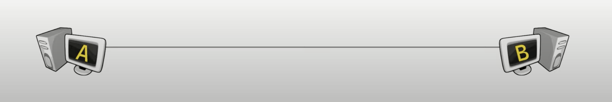
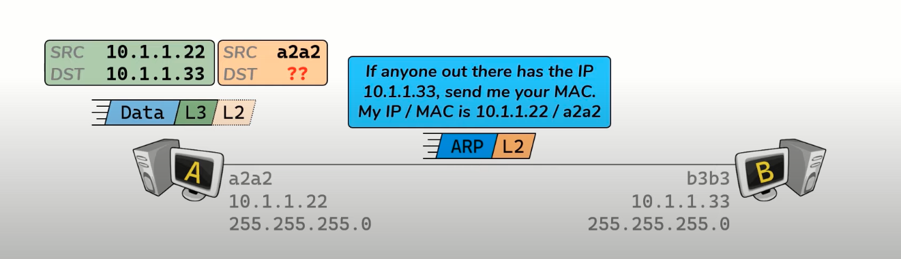

# Everything hosts do to speak on the internet 

## Module 1 - Paclet Traveling

- Host connected directly to each other. (Hosts communicating to another host in the same network) 

- Host connected through a Router. (Host communicating to another host in a foreign network) 

### Host communicating to anther host in the same network

Host A and Host B are directly connected: 
- Both hosts have a NIC, and therefore a MAC address

- Both hosts are configured with an IP address and Subnet Mask:
    - Subnet mask identifies the size of the IP network 
    - Subnetting is not convered in this lesson - www.subnetIPv4.com 

Host A has some Data to send to Host B

-  Networking doesn't care what data is - it's just 1 and 0 

- Host A knows the IP  address of Host B 

- Host A can create the L3 header to attach to the Data 

- Host A does not know Host B's MAC Address:

    - Host A must use Address Rosolution Protocal (ARP)
    - ARP request asks for the MAC address associated with target ip
    - ARP request includes sender's MAC address
    - ARP request is a Broadcast - sent to everyone on the network 
    - Destination MAC address : ffff.ffff.ffff.ffff
    - Reserved MAC address to send a packet to everyone on the local network 
- Host A uses ARP to resolve target's MAC Address
    - ARP request ask for the MAC address associated with known IP 
    - ARP Mapping are stored in an ARP Cache
    - Host B responds by sending an ARP Response
    - Response it sent Unicast (directly to host A)

- Host A populates it's ARP cache with B's IP/MAC mapping

- Host A creates L2 header

Data is sent to Host B 
 - L2 header is discarded 
 - L3 header is discarded