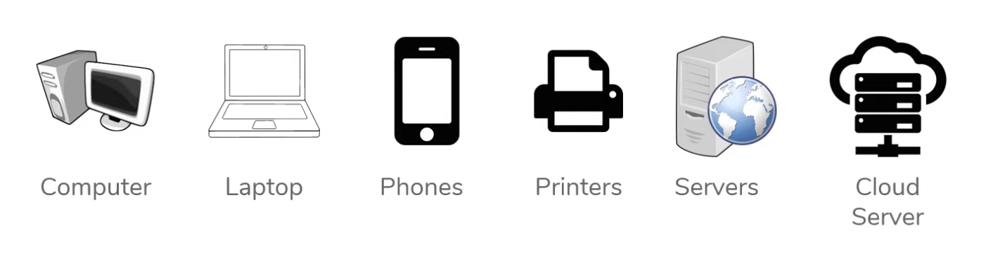
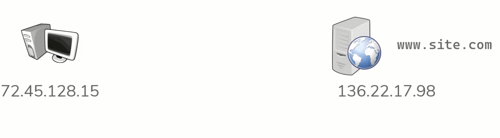
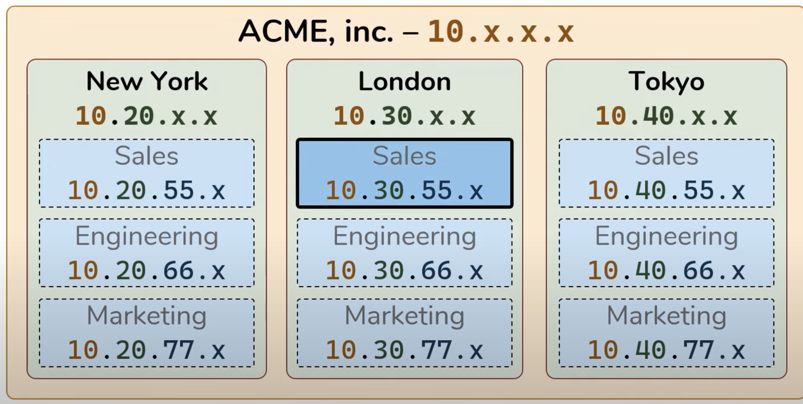

# Host, IP Adress and Network 

## Host 
Host is any device which is send or receives traffic.
Example : 

Or any IOT device: 
Example : TV, speaker, smart swatches, etc ...
Anything that sends or recevies over a network . 

### Client and Server

- Client initiate requests,Server reponse 
- relative to specified to communicate
- server are simply computer with software installed which respond to specific request.

### IP Adress 
- An IP Adress is the identity for each host 

- IP address are 32bit (bit = 1 || 0) . 
- Represent as four Octest.
- hierarchically assign .

Example:
 

### Network 
How to tranffer data between host before we have network ? (disk,usb,thumb driver etc)

A network is what transport tranffic bettwen host 
- Anytime two hosts are connected, You have a network

- Logical grouping of host which requires similar connectivity

- Network can contain other network(it called subnet-network or subnet)

- N x subnet connect . We called  internet