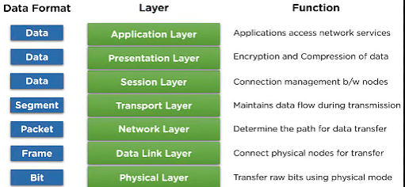
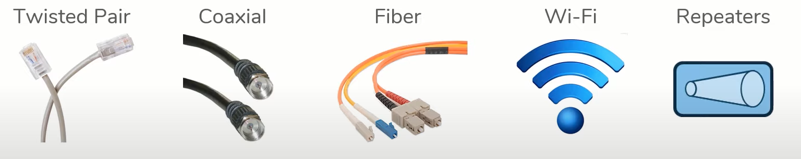

# OSI Model

OSI Model purpose of networking.

- Allow two hosts to share data with one anthor

- Host must follow a set of rules 

Example : 

1. English language has rules. 

2. Spanish language has rules.
The rules for Networking are divided into seven layers .

1. Each layer serves a specific function.

2. If all layer are funcctionging, host can share data.

## Layer 1- Physical 

- Computer data exists in the form of Bits ( 1 or 0)

- Something has to transport those bits between hosts 

- L1 Technology : Cables

## Layer 2 - Data Link - (HOP to HOP)
Interacts with the wire (i.e Physical layer)

- NIC - Network interface Cards / Wifi - Access Cards
- Layer 2  make addressing scheme - MAC addresses : 48 bits , repersented as 12 hex digits
Example : 94-65-9c-3b-8a-e5
- L2 Technology : NICs, Switches
- Often communication between hosts require multiple hops

## Layer 3 - Network (End to End)
Addressing Scheme - IP Address
- 32 bit, represented as 4 octest , each 0 -255 
- L3 technology : Routers, Hosts 

- ARP - Address Resolution Protocol: It used Mac + IP to transition data