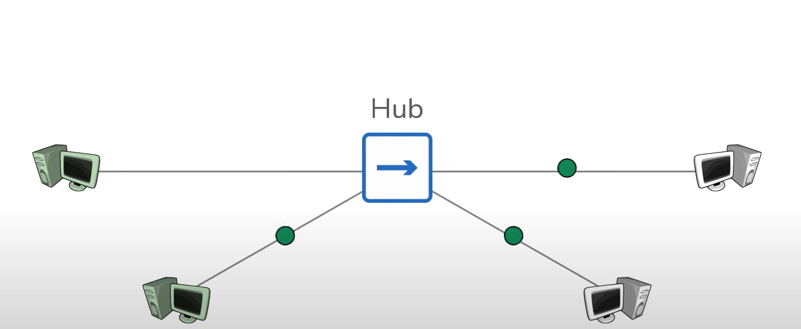

# Hub, Bridge, Switch, Router - Networking Fundamentals 

## Repeater 

- Repeater is regenerated signals 
- Repeater allows server connnect to server at a distance 

Issue : connecting host directly to each other doesn't scale 

## Hub 

- Hub is simply multi-port repeaters
- Facilitates scaling communication between additional hosts 
- Everyone receives everyone else's data 

## Bridges bit between hub-connected hosts

- Bridges only have two ports 
- Bridges learn which hosts are on each side 

## Swtich 

Switches are a combination of Hubs and  Bridges 

- Multiple Ports 
- Learns which hosts are on each port 

- Different: Facilitate communication within a network

- Network: Grouping of hosts which require smilar connectivity

## Router facilitate communication betwwen network 

- Network: Grouping of host which requie similar connectivity
- Provides a traffic control point (security, filtering, reporting)

tranditionally,swtiches could not pergorm such fitering 

Routing table - all networks a router knows about 

- Routing is the process of moving data between networks 
There are many other Network Devies: 
- Access Point 
- Firewalls 
- Load Balancers 
- Virtual switches 
- Layer 3 Switches
- IDS / IPS 
- Proxies 
- Virtual Routers