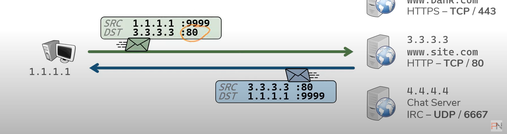
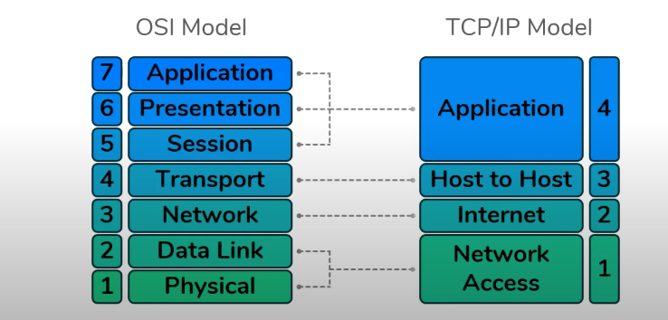

# OSI Model 

## Layer 4 - Transport - Service to Service 

- Distinguish data streams.

- Addressing scheme - Ports :    
    - 0 - 65535 - TCP (favors reliability)
    - 0 - 65535 - UDP (favors efficiency)

## Layer 5,6,7 - Session, Presentation, Application

- Distinction between these layers is somewhat vague 
- Other networking Models combine these into one layer 

### Layer 5 - Session

Session is layer communicate with the application. It  set up and maintain and close connect between sessions. 

Example : It allows dowload a large size from host and continue form host if connect has skiped 

### Layer 6 - Presentation

This layer used to decode data. It will transfer data to file like ascii,jpge,v.v ... 

Example : It will encode data to ascii after sending.

### Layer 7 - Application 

This layer conmunicate directly with user or application. It provides the interface application ,

Example : Application Chat used it to communicate
